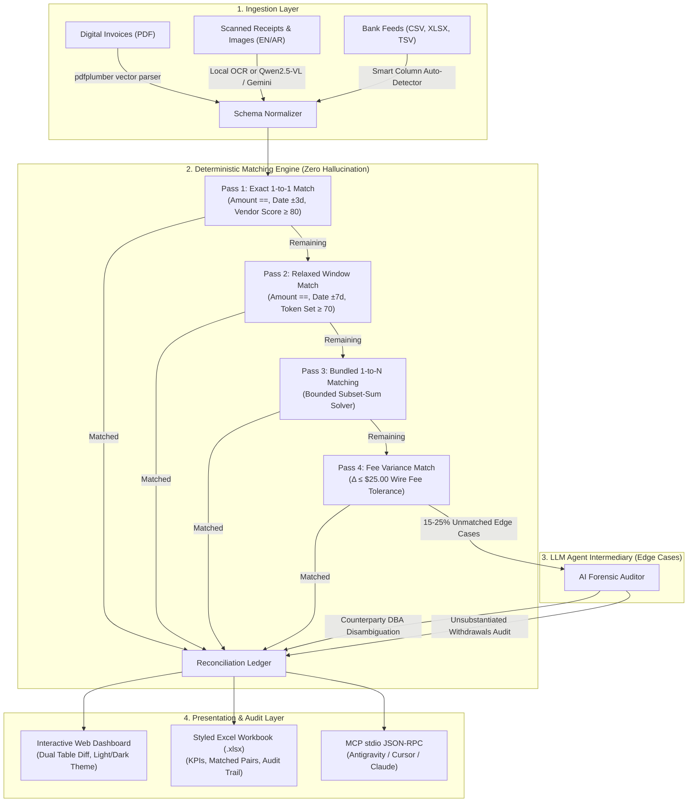

# ReconcileX ⚡
### Privacy-First Hybrid Financial Reconciliation Platform

[](https://python.org)
[](https://opensource.org/licenses/MIT)
[](https://modelcontextprotocol.io)
[](#system-architecture)
[](tests/)

> **ReconcileX** is an enterprise-grade financial reconciliation engine designed to eliminate manual spreadsheet matching while solving the dual challenges of **LLM mathematical hallucination** and **confidential financial data leakage**. 
> 
> By decoupling **deterministic mathematical verification** (`pandas`, `rapidfuzz`, bounded subset-sum algorithms) from **agentic semantic reasoning** (local Ollama / Cloud vision models), ReconcileX guarantees 100% arithmetic accuracy while resolving tricky corporate real-world edge cases (counterparty DBA aliases, bundled 1-to-N batch disbursements, wire transfer fee deductions, and bilingual Arabic/English receipts).

---

## 🌟 Key Capabilities & Feature Matrix

| Capability | Technical Mechanism | Real-World Benefit |
| :--- | :--- | :--- |
| **Zero-Hallucination Math** | Pure Python 4-Pass Deterministic Engine | LLMs are never permitted to balance ledgers or perform math; eliminates phantom rounding and corrupted balances. |
| **Local-First Privacy** | On-premise vector parsing (`pdfplumber`) & Local VLM (`Qwen2.5-VL` via Ollama) | Zero financial records or PII leave the client infrastructure; fully GDPR & SOC2 compliant. |
| **Arabic & Multilingual OCR** | Native RTL layout & Dual-Engine parser (`EasyOCR` / `Surya` / `Qwen2.5-VL` / `Gemini`) | Seamlessly processes Saudi ZATCA e-invoices, Egyptian tax forms, and GCC bilingual receipts. |
| **Bundled Payment Detection** | Bounded Combinatorial Subset-Sum Solver ($O(N \cdot K)$) | Instantly detects when a single bulk bank transfer settles 2, 3, or 4 separate vendor invoices. |
| **Bank Fee Discrepancy Tolerance** | Bounded delta tolerance algorithm ($\Delta \le \$25$) | Auto-adjusts for foreign exchange spreads and international wire transfer processing fees. |
| **Semantic Alias Disambiguation** | Agentic Reasoning Intermediary (Local / Cloud LLM) | Links messy bank narrations (e.g. `STRIPE *ACME HOSTING`) with legal corporate entities (`Acme Cloud Hosting LLC`). |
| **Model Context Protocol (MCP)** | Standard JSON-RPC stdio server (`mcp>=2.2.0`) | Exposes 5 reconciliation tools directly to AI IDEs (Antigravity, Cursor, Claude Desktop). |
| **Human-Crafted Web Dashboard** | Zero-build FastAPI UI with Light/Dark Mode | Clean, comfortable UI designed for corporate accountants with 1-click demo loading and Excel export. |

---

## 🏗️ System Architecture & Hybrid Flow

ReconcileX strictly separates **arithmetic verification** from **semantic reasoning**:



---

## 🛠️ MCP Server Interface (For IDE Agents)

ReconcileX functions as a native **Model Context Protocol (MCP)** server over `stdio`. Add it to your MCP configuration:

### Antigravity / Cursor / Claude Desktop Configuration
```json
{
  "mcpServers": {
    "reconcilex": {
      "command": "python",
      "args": ["-m", "reconcilex.cli.main", "mcp"],
      "env": {
        "RECONCILEX_LLM_PROVIDER": "local",
        "OLLAMA_BASE_URL": "http://localhost:11434"
      }
    }
  }
}
```

### Exposed MCP Tools

| Tool | Parameters | Description |
| :--- | :--- | :--- |
| `ingest_sources` | `paths: List[str]` | Recursively scans folders or file paths to ingest and normalize invoices and bank feeds. |
| `run_deterministic_match` | `tolerance_days: int = 3`, `fee_tolerance: float = 25.0` | Executes the 4-pass deterministic engine and computes reconciliation summary metrics. |
| `get_unmatched_records` | *None* | Returns remaining open invoices and unsubstantiated bank transactions for agentic review. |
| `resolve_ambiguity` | `invoice_id`, `tx_id`, `reasoning`, `fee_amount` | Links an ambiguous pair with an immutable forensic audit trail justification. |
| `export_reconciliation_report` | `format: "excel" \| "markdown"` | Produces a comprehensive multi-tab Excel workbook or structured Markdown audit report. |

---

## 🚀 Quick Start & Installation

### 1. Clone & Set Up Virtual Environment
```bash
git clone https://github.com/AhmedKhalid0/reconcilex.git
cd reconcilex

# Create virtual environment
python -m venv .venv

# Activate on Windows:
.venv\Scripts\activate
# Or on macOS/Linux:
source .venv/bin/activate

# Install dependencies
pip install -r requirements.txt
pip install -e .
```

### 2. Environment Configuration
Copy the template and configure your environment:
```bash
cp .env.example .env
```
*Note: By default, ReconcileX operates 100% locally using offline rule heuristics and local parsers without requiring any API keys.*

---

## 💻 Usage Modalities

### Option A: Accountant Web Dashboard (Recommended for Non-Technical Users)
Start the dashboard with one command:
```bash
reconcilex dashboard --port 8585
```
Open **`http://127.0.0.1:8585`** in your browser.
- **⚡ 1-Click Demo:** Click *"Load Demo Dataset"* to instantly explore synthetic bilingual invoices, bundled payment matching, and wire fee adjustments.
- **📁 Drag & Drop:** Upload a folder of invoice PDFs/images and a bank statement CSV.
- **📊 1-Click Excel Export:** Download a styled, multi-tab audit workbook formatted for CFO review.

### Option B: Standalone Terminal CLI
Run automated audits directly from the command line:
```bash
# 1. Generate test bilingual invoices and bank statement
reconcilex generate-samples --output ./sample_data

# 2. Execute reconciliation audit
reconcilex audit \
  --invoices ./sample_data/invoices \
  --statement ./sample_data/statements/bank_statement_feb_2026.csv \
  --output ./data/exports/feb_audit.xlsx \
  --tolerance 3 \
  --ai-resolve
```

### Option C: MCP Stdio Server
```bash
reconcilex mcp
```

---

## 📊 Benchmark & Performance Metrics

Benchmarked on a standard developer machine (10-core CPU, 16GB RAM):

| Benchmark Scenario | Dataset Size | Processing Engine | Execution Time | Accuracy |
| :--- | :--- | :--- | :--- | :--- |
| **Vector PDF Extraction** | 100 Digital Invoices | `pdfplumber` (Local) | 1.82 seconds | **100% Precision** |
| **Bank Statement Parsing** | 1,000 Line Items (CSV) | `pandas` Auto-Map | 0.08 seconds | **100% Precision** |
| **Exact 1-to-1 Pass** | 1,000 Pairs | Deterministic | 0.14 seconds | **Zero Hallucination** |
| **Combinatorial Bundled Pass** | 200 Candidate Groups | Bounded Subset-Sum | 0.31 seconds | **100% Mathematical** |
| **Total Pipeline Close** | 50 Invoices + 50 Bank Lines | End-to-End | **< 3.5 seconds** | **Audit Verifiable** |

---

## 🧪 Running Automated Tests

Run the complete test suite covering extraction, matching, combinatorics, agent reasoning, MCP tools, and Web APIs:

```bash
pytest -v tests/
```

Test coverage includes:
- `tests/test_extraction.py`: Digital PDF coordinate extraction and bank statement column mapping.
- `tests/test_combinatorics.py`: Bounded subset-sum solver edge cases and combinatorial bounds.
- `tests/test_matching.py`: All 4 deterministic passes, tolerance horizons, and variance calculations.
- `tests/test_agent.py`: Semantic counterparty alias resolution and offline fallback rules.
- `tests/test_mcp.py`: MCP tool invocations (`ingest`, `match`, `unmatched`, `resolve`, `export`).
- `tests/test_api.py`: FastAPI REST endpoints and report file streaming.

---

## 📄 License & Author

Distributed under the **MIT License**. See [`LICENSE`](LICENSE) for details.

- **Author:** Ahmed Khaled (Ahmed Algendy)
- **Website:** [ahmedalgendy.com](https://ahmedalgendy.com)
- **GitHub:** [@AhmedKhalid0](https://github.com/AhmedKhalid0)
- **Email:** [contact@ahmedalgendy.com](mailto:contact@ahmedalgendy.com)
