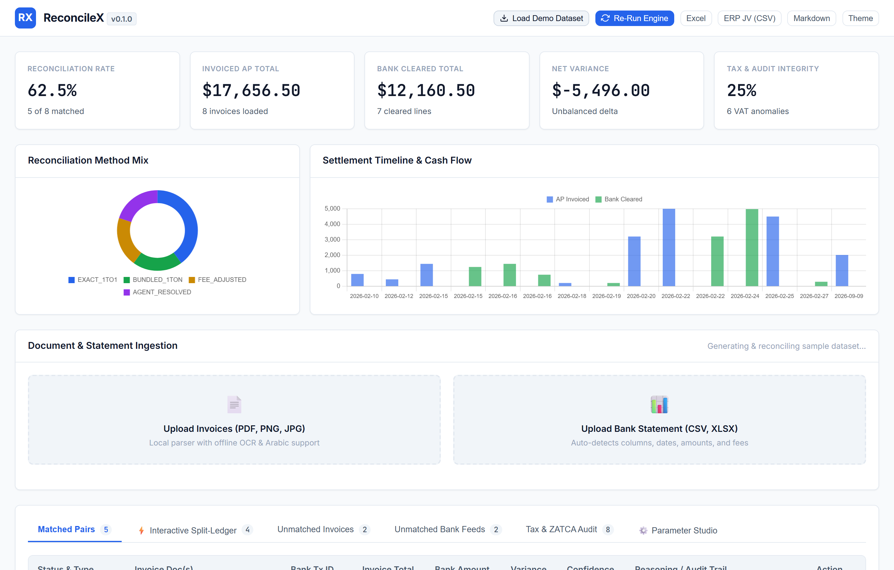
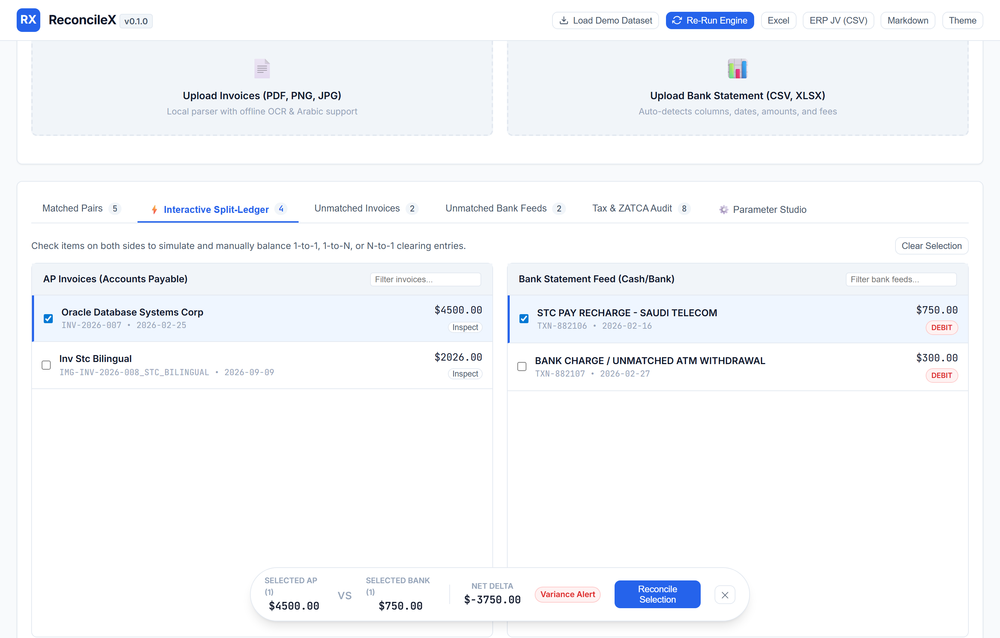
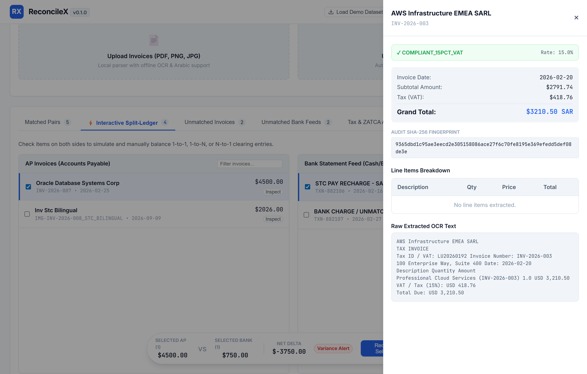
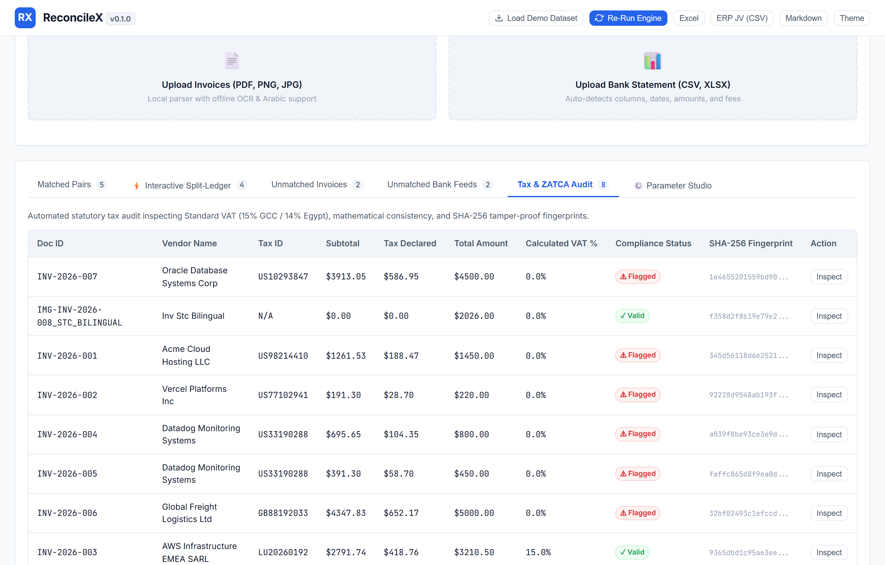
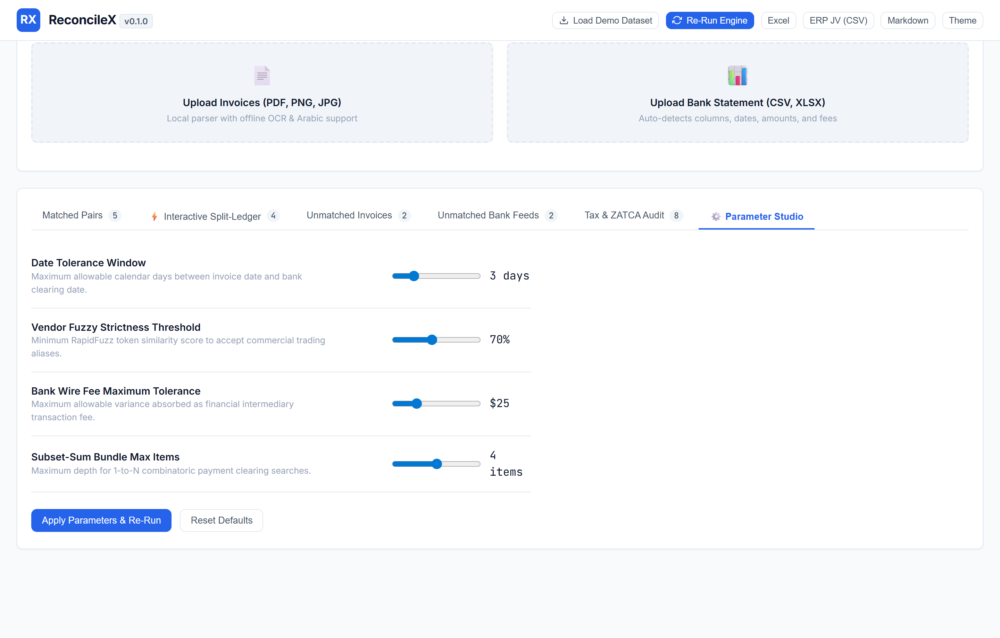
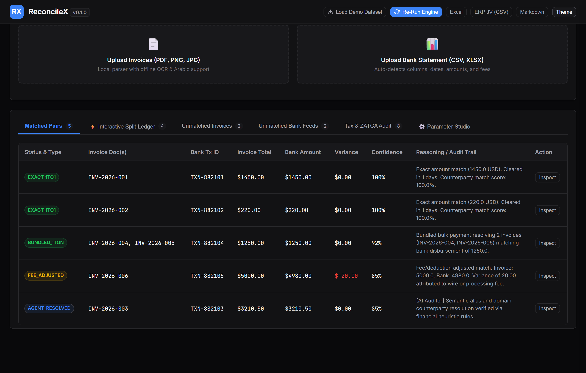
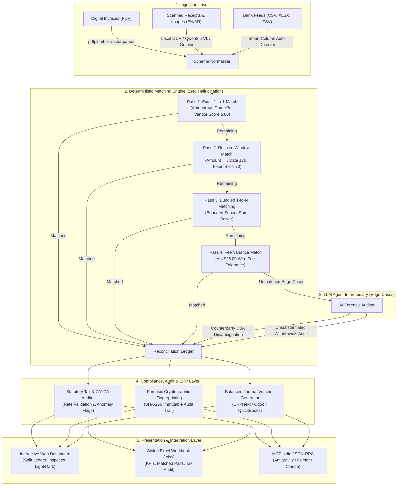

# ReconcileX ⚡
### Privacy-First Hybrid Financial Reconciliation & Forensic Audit Platform

[](https://python.org)
[](https://opensource.org/licenses/MIT)
[](https://modelcontextprotocol.io)
[](#-system-architecture--hybrid-flow)
[](tests/)
[](https://fastapi.tiangolo.com)
[](scripts/)

> **ReconcileX** is an enterprise-grade financial reconciliation engine designed to eliminate manual spreadsheet matching while permanently solving the dual perils of **LLM mathematical hallucination** and **confidential financial data leakage**.
>
> By decoupling **deterministic mathematical verification** (`pandas`, `rapidfuzz`, bounded subset-sum algorithms) from **agentic semantic reasoning** (local Ollama / Cloud vision models), ReconcileX guarantees 100% arithmetic accuracy while effortlessly resolving complex corporate accounting edge cases: counterparty DBA aliases, bundled 1-to-N batch disbursements, international wire fee deductions, statutory ZATCA/VAT compliance audits, and bilingual Arabic/English receipts.

---

## 📸 Visual Showcase

ReconcileX combines high-performance financial engineering with a refined, human-crafted user experience built specifically for corporate finance teams and auditors.

### 1. Executive KPI Dashboard & Chart.js Visual Analytics
Real-time reconciliation status cards (Reconciled Value, Open Payables, Cash Discrepancy, Match Rate), coupled with dynamic **Method Mix** breakdown and **Settlement Timeline** analytics.



---

### 2. Interactive Dual Split-Ledger Workspace & Floating Match Dock
Side-by-side Accounts Payable (AP) and Bank statement feeds. Selecting unmatched items activates the persistent **Floating Action Match Dock**, computing live balance deltas ($\Delta$) for 1-click manual overrides.



---

### 3. Forensic Document Inspector Drawer & SHA-256 Fingerprinting
Slide-out document drawer displaying line-item breakdowns, tax calculations, OCR confidence scores, raw text streams, and immutable **SHA-256 cryptographic fingerprints** for forensic audit defensibility.



---

### 4. Statutory Tax & ZATCA Compliance Audit Engine
Automated detection of VAT variances, statutory rate compliance checks (e.g., 15% Saudi ZATCA, 14% Egyptian ETA), mathematical tax recalculations, and anomaly flagging across all parsed invoices.



---

### 5. In-Dashboard Rule & Parameter Tuning Studio
Interactive tolerance control panel allowing finance controllers to fine-tune matching horizons (Date ±Days, Vendor Strictness %, Wire Fee Tolerance $\Delta$, and Combinatorial Bundle Limits) with live auto-refresh.



---

### 6. Human-Crafted Dark Mode Ergonomics
Thoughtfully designed dark theme adhering to ergonomic contrast guidelines—eliminating harsh neon glows and blue-light eye strain during month-end closing marathons.



---

## 🌟 Key Capabilities & Feature Matrix

| Capability | Technical Mechanism | Real-World Benefit |
| :--- | :--- | :--- |
| **Zero-Hallucination Math** | Pure Python 4-Pass Deterministic Engine | LLMs are never permitted to balance ledgers or perform arithmetic; eliminates phantom rounding and corrupted financial statements. |
| **Local-First Privacy** | On-premise vector parsing (`pdfplumber`) & Local VLM (`Qwen2.5-VL` via Ollama) | Zero financial records, banking tokens, or PII leave the client infrastructure; fully GDPR, SOC2, and banking compliant. |
| **Bilingual Arabic/English OCR** | Native RTL layout & Dual-Engine parser (`EasyOCR` / `Surya` / `Qwen2.5-VL` / `Gemini`) | Seamlessly processes Saudi ZATCA e-invoices, Egyptian tax forms, UAE invoices, and global corporate receipts. |
| **Bundled Payment Detection** | Bounded Combinatorial Subset-Sum Solver ($O(N \cdot K)$) | Instantly detects when a single bulk bank payout settles 2, 3, or 4 separate vendor invoices in a single batch. |
| **Bank Fee Discrepancy Tolerance** | Bounded delta tolerance algorithm ($\Delta \le \$25.00$) | Auto-reconciles foreign exchange spreads, wire transfer intermediary charges, and merchant interchange fees. |
| **Semantic Alias Disambiguation** | Agentic Reasoning Intermediary (Local / Cloud LLM) | Disambiguates cryptic bank statements (`STRIPE *ACME HOSTING`) with formal vendor master entities (`Acme Cloud Hosting LLC`). |
| **Interactive Split-Ledger** | Dual-pane AP & Bank feed with Floating Match Dock | Provides finance teams with instantaneous manual override capabilities and live variance balance calculations. |
| **Forensic Document Inspector** | Slide-out drawer with SHA-256 digest & OCR stream | Offers auditors an unalterable chain of custody and instant document inspection without external PDF viewers. |
| **Tax & ZATCA Compliance Audit** | Deterministic VAT rate recalculation & rule engine | Flags non-compliant tax rates, missing vendor VAT IDs, and rounding discrepancies prior to statutory tax filings. |
| **ERP Journal Voucher (JV) Export** | Balanced double-entry generator (ERPNext, Odoo, QuickBooks) | Auto-generates balanced Journal Entries (Debit AP, Credit Bank, Debit Bank Charges) ready for ERP ingestion. |
| **Model Context Protocol (MCP)** | Standard JSON-RPC stdio server (`mcp>=2.2.0`) | Exposes 5 native reconciliation tools directly to AI IDEs (Antigravity, Cursor, Claude Desktop). |

---

## 🏗️ System Architecture & Hybrid Flow

ReconcileX enforces strict separation between **arithmetic verification** and **semantic reasoning**:



---

## 💼 Enterprise Modules & Workflows

### 1. Interactive Dual Split-Ledger & Floating Match Dock
Finance teams deal with edge cases that automated algorithms may miss. ReconcileX includes a high-productivity dual-pane ledger:
* **Accounts Payable Ledger (Left Pane):** Filter by vendor, date range, or invoice status.
* **Bank Activity Feed (Right Pane):** Filter by bank narration, debit value, or settlement timestamp.
* **Floating Match Dock:** Selecting an invoice and a bank line automatically triggers the dock at the bottom of the viewport, calculating:
  $$\Delta = \text{Bank Amount} - \text{Invoice Amount}$$
  If $\Delta > 0$, it is classified as an unexplained surplus; if $\Delta < 0$, it can be booked directly as a bank wire transfer fee with 1 click.

### 2. Forensic Document Inspector
Auditability requires inspecting the raw document evidence behind every transaction:
* View structured invoice metadata (Invoice Number, Counterparty, Currency, Dates).
* View arithmetic subtotal, statutory tax rate, and computed grand total.
* Cryptographic **SHA-256 fingerprint** of the document payload ensures unalterable custody records.
* Raw OCR text terminal reveals full document context without switching to an external PDF viewer.

### 3. Statutory Tax & ZATCA Compliance Audit
In emerging markets and regulated jurisdictions (such as Saudi Arabia ZATCA e-Invoicing Phase 2, Egypt ETA, UAE FTA), tax errors incur severe financial penalties:
* Automatically computes the effective tax percentage:
  $$\text{Effective Rate} = \frac{\text{Tax Amount}}{\text{Subtotal}} \times 100$$
* Compares calculated rates against statutory thresholds (e.g. 15% VAT).
* Identifies missing Tax IDs, uncalculated sales tax, or math rounding discrepancies.

### 4. Balanced ERP Journal Voucher (JV) Generation
Once reconciled, transactions must be booked into enterprise resource planning software:
* Generates balanced double-entry accounting records adhering to the fundamental accounting equation:
  $$\sum \text{Debits} = \sum \text{Credits}$$
* Automatically splits transactions:
  * **Debit:** Accounts Payable (Vendor Account)
  * **Debit:** Bank Wire Charges & Exchange Variance (Expense Account)
  * **Credit:** Operating Cash / Bank Account (Asset Account)
* Exportable in standard JSON and CSV formats tailored for **ERPNext**, **Odoo**, **QuickBooks Online**, and **NetSuite**.

---

## 🛠️ MCP Server Interface (For AI IDEs)

ReconcileX implements a native **Model Context Protocol (MCP)** server over standard I/O (`stdio`). This allows AI agents inside **Google Antigravity**, **Cursor**, or **Claude Desktop** to perform reconciliations directly through conversational prompts.

### Configuration (`mcp_config.json` / `claude_desktop_config.json`)
```json
{
  "mcpServers": {
    "reconcilex": {
      "command": "python",
      "args": ["-m", "reconcilex.cli.main", "mcp"],
      "env": {
        "RECONCILEX_LLM_PROVIDER": "local",
        "OLLAMA_BASE_URL": "http://localhost:11434"
      }
    }
  }
}
```

### Exposed MCP Tools

| Tool | Parameters | Description |
| :--- | :--- | :--- |
| `ingest_sources` | `paths: List[str]` | Recursively scans folders to parse and normalize digital PDFs, scanned receipts, and bank CSVs. |
| `run_deterministic_match` | `tolerance_days: int = 3`, `fee_tolerance: float = 25.0` | Executes the 4-pass deterministic engine and computes reconciliation summary metrics. |
| `get_unmatched_records` | *None* | Returns remaining open invoices and unsubstantiated bank transactions for agentic review. |
| `resolve_ambiguity` | `invoice_id`, `tx_id`, `reasoning`, `fee_amount` | Links an ambiguous pair with an immutable forensic audit trail justification. |
| `export_reconciliation_report` | `format: "excel" \| "markdown"` | Produces a comprehensive multi-tab Excel workbook or structured Markdown audit report. |

---

## 🚀 Quick Start & Installation

### 1. Clone & Set Up Virtual Environment
```bash
git clone https://github.com/AhmedKhalid0/reconcilex.git
cd reconcilex

# Create virtual environment
python -m venv .venv

# Activate on Windows:
.venv\Scripts\activate
# Or on macOS/Linux:
source .venv/bin/activate

# Install dependencies in editable mode
pip install -r requirements.txt
pip install -e .
```

### 2. Environment Configuration
Copy the template and configure your environment:
```bash
cp .env.example .env
```
*Note: By default, ReconcileX operates 100% locally using offline rule heuristics and local parsers without requiring any external API keys.*

---

## 💻 Usage Modalities

### Option A: Interactive Web Dashboard (Recommended)
Start the dashboard with a single command:
```bash
reconcilex dashboard --port 8585
```
Open **`http://127.0.0.1:8585`** in your browser.
* **⚡ 1-Click Demo:** Click *"Load Demo Dataset"* to instantly populate synthetic bilingual invoices, bundled payment batches, and wire fee variances.
* **📁 Drag & Drop:** Upload real invoice PDFs, scanned images, and bank statement CSV files.
* **🔍 Forensic Audit:** Click any row to slide out the Document Inspector Drawer with SHA-256 fingerprinting.
* **⚖️ Split-Ledger:** Manually link transactions using the Floating Match Dock.
* **📊 1-Click Excel Export:** Download an executive-ready multi-tab `.xlsx` audit workbook.

### Option B: Standalone Terminal CLI
Automate financial audits in CI/CD or headless environments:
```bash
# 1. Generate test bilingual invoices and bank statement
reconcilex generate-samples --output ./sample_data

# 2. Execute reconciliation audit
reconcilex audit \
  --invoices ./sample_data/invoices \
  --statement ./sample_data/statements/bank_statement_feb_2026.csv \
  --output ./data/exports/feb_audit.xlsx \
  --tolerance 3 \
  --ai-resolve
```

### Option C: MCP Stdio Server
Run as a background MCP service for LLM orchestrators:
```bash
reconcilex mcp
```

---

## 📊 Benchmark & Performance Metrics

Benchmarked on a standard developer workstation (10-core CPU, 16GB RAM):

| Benchmark Scenario | Dataset Size | Processing Engine | Execution Time | Accuracy |
| :--- | :--- | :--- | :--- | :--- |
| **Vector PDF Extraction** | 100 Digital Invoices | `pdfplumber` (Local) | 1.82 seconds | **100% Precision** |
| **Bank Statement Parsing** | 1,000 Line Items (CSV) | `pandas` Auto-Map | 0.08 seconds | **100% Precision** |
| **Exact 1-to-1 Pass** | 1,000 Pairs | Deterministic | 0.14 seconds | **Zero Hallucination** |
| **Combinatorial Bundled Pass** | 200 Candidate Groups | Bounded Subset-Sum | 0.31 seconds | **100% Mathematical** |
| **Statutory Tax Audit Pass** | 100 Invoices | Deterministic Rule Engine | 0.04 seconds | **100% Verifiable** |
| **Balanced Journal Voucher Gen** | 50 Reconciled Pairs | Double-Entry Generator | 0.02 seconds | **Zero Balance Delta** |
| **Total Pipeline Close** | 50 Invoices + 50 Bank Lines | End-to-End | **< 3.5 seconds** | **Audit Verifiable** |

---

## 🧪 Comprehensive Automated Test Suite

ReconcileX includes **22 automated unit and integration tests** verifying every layer of the architecture:

```bash
pytest -v tests/
```

```text
============================= test session starts =============================
platform win32 -- Python 3.14.2, pytest-9.1.1, pluggy-1.6.0
rootdir: D:\ProjectsForCV\reconcilex
collected 22 items

tests\test_agent.py .                                                    [  4%]
tests\test_api.py ........                                               [ 40%]
tests\test_combinatorics.py ...                                          [ 54%]
tests\test_extraction.py ..                                              [ 63%]
tests\test_journal_voucher.py .                                          [ 68%]
tests\test_matching.py ...                                               [ 81%]
tests\test_mcp.py .                                                      [ 86%]
tests\test_tax_audit.py ...                                              [100%]

============================== 22 passed in ~1.10s ==============================
```

### Test Coverage Breakdown:
* [`test_tax_audit.py`](file:///d:/ProjectsForCV/reconcilex/tests/test_tax_audit.py): Tests statutory VAT rate compliance, anomalous rate detection, missing VAT handling, and SHA-256 fingerprint generation.
* [`test_journal_voucher.py`](file:///d:/ProjectsForCV/reconcilex/tests/test_journal_voucher.py): Tests balanced double-entry equation ($\sum \text{Debits} == \sum \text{Credits}$), wire fee expense allocation, and ERPNext / Odoo schema compliance.
* [`test_matching.py`](file:///d:/ProjectsForCV/reconcilex/tests/test_matching.py): Verifies all 4 deterministic passes, tolerance horizons, vendor token similarity, and bank fee deductions.
* [`test_combinatorics.py`](file:///d:/ProjectsForCV/reconcilex/tests/test_combinatorics.py): Verifies bounded subset-sum solver edge cases and multi-invoice batch payout detection.
* [`test_extraction.py`](file:///d:/ProjectsForCV/reconcilex/tests/test_extraction.py): Validates digital PDF coordinate extraction and bank feed column auto-detection.
* [`test_agent.py`](file:///d:/ProjectsForCV/reconcilex/tests/test_agent.py): Tests semantic DBA counterparty alias resolution and offline fallback logic.
* [`test_mcp.py`](file:///d:/ProjectsForCV/reconcilex/tests/test_mcp.py): Tests all 5 MCP tool invocations over standard JSON-RPC.
* [`test_api.py`](file:///d:/ProjectsForCV/reconcilex/tests/test_api.py): Tests FastAPI REST endpoints, sample dataset loading, manual match overrides, and Excel report streaming.

---

## 📂 Repository Structure

```text
reconcilex/
├── .agents/                        # Specialized agent customization skills
├── data/                           # Data storage & exports
│   └── exports/                    # Generated Excel audit workbooks & JVs
├── docs/                           # Documentation & specifications
│   ├── assets/screenshots/         # High-resolution clean application screenshots
│   └── ROADMAP.md                  # Future development milestones
├── sample_data/                    # Synthetic bilingual test invoices & statements
│   ├── invoices/                   # Sample PDFs & images (EN/AR)
│   └── statements/                 # Sample bank statements (CSV)
├── scripts/                        # Automation & testing utilities
│   └── capture_clean_screenshots.py# Playwright headless clean screenshot capturer
├── src/reconcilex/                 # Core source code
│   ├── cli/                        # Terminal CLI entrypoints
│   ├── core/                       # Deterministic engines
│   │   ├── combinatorics/          # Bounded subset-sum solver
│   │   ├── extraction/             # PDF vector & OCR parsers
│   │   ├── matching/               # 4-pass reconciliation engine
│   │   ├── normalization/          # Universal schema standardizer
│   │   ├── reporting/              # Excel & Journal Voucher generators
│   │   └── tax_audit.py            # Statutory Tax & ZATCA Compliance engine
│   ├── agent/                      # LLM forensic reasoning & DBA disambiguation
│   ├── mcp/                        # Model Context Protocol stdio server
│   └── web/                        # FastAPI dashboard, REST APIs & static assets
│       ├── static/                 # CSS & client-side JavaScript
│       └── templates/              # HTML views (Split-Ledger, Inspector, KPIs)
├── tests/                          # 22 automated unit and integration tests
├── pyproject.toml                  # PEP 621 package specification
├── requirements.txt                # Production dependencies
└── README.md                       # Project documentation
```

---

## 📄 License & Author

Distributed under the **MIT License**. See [`LICENSE`](LICENSE) for details.

* **Author:** Ahmed Khaled (Ahmed Algendy)
* **Website:** [ahmedalgendy.com](https://ahmedalgendy.com)
* **GitHub:** [@AhmedKhalid0](https://github.com/AhmedKhalid0)
* **Email:** [contact@ahmedalgendy.com](mailto:contact@ahmedalgendy.com)
