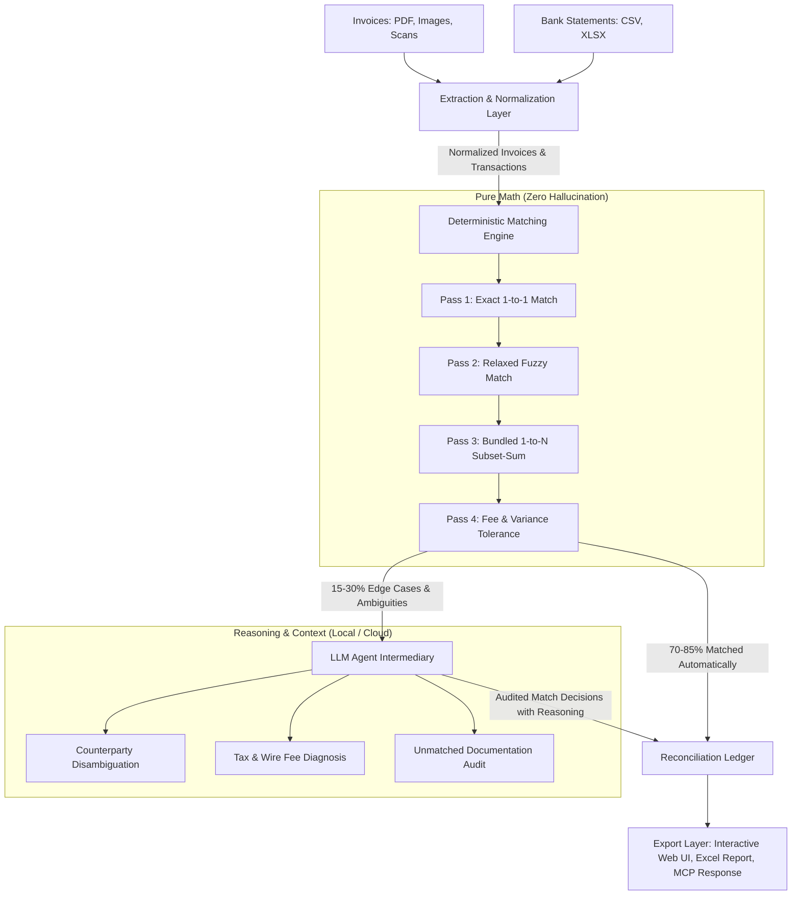
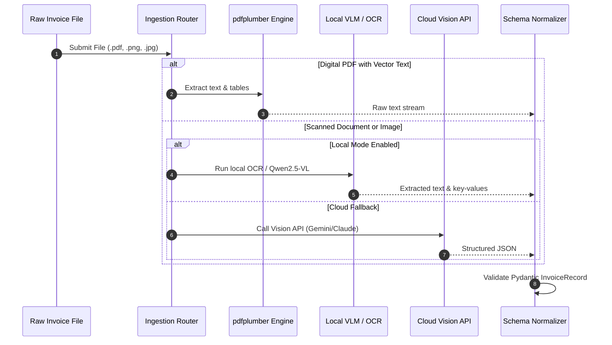
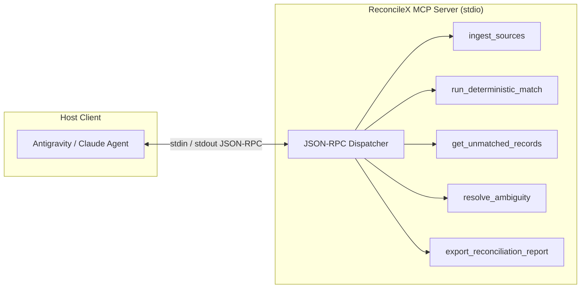

# Architecture & Technical Design Document
## ReconcileX: Privacy-First Hybrid Financial Reconciliation Engine

**Author:** Ahmed Khaled (Ahmed Algendy) <contact@ahmedalgendy.com>  
**Version:** 1.0.0  
**Date:** March 2026  

---

## 1. Architectural Philosophy: The Hybrid Deterministic-Agentic Model

Modern generative AI models are exceptional at natural language parsing, fuzzy contextual reasoning, and visual entity extraction. However, they are fundamentally probabilistic and prone to hallucination when performing arithmetic calculations. 

**ReconcileX** solves this via a strict **Separation of Concerns**:
- **Math is 100% Deterministic:** Balancing debits/credits, computing variances, searching for bundled payment combinations, and verifying ledger equations is executed purely by deterministic algorithms (`pandas`, custom `Bounded Subset-Sum`, and `rapidfuzz`). An LLM is never permitted to perform unverified arithmetic.
- **Extraction & Context are Agentic:** Reading noisy scanned receipts, understanding Arabic tax forms, resolving cryptic bank narrations (`"VNDR*9481 AMZN MKTPL"`), and diagnosing wire fee deductions is handled by Vision-Language Models (VLMs) and constrained LLM agents.

---

## 2. Ingestion & Extraction Architecture

### 2.1 Digital Invoices vs. Scanned Receipts
The ingestion pipeline dynamically inspects document mime-types and structural streams:

1. **Digital PDFs (Native Vector Text):**
   - Parsed directly using `pdfplumber`.
   - Extracts structured text coordinates, tables, and bounding boxes.
   - Zero GPU or API cost; 100% deterministic accuracy on digital invoices.
2. **Scanned Images & Photographed Receipts (Arabic & Multilingual):**
   - **Local-First Tier (Default):**
     - Modern OCR engine (`EasyOCR` / `Surya-OCR`) with native Arabic & English language packs.
     - Local Multimodal VLM via Ollama (`qwen2.5vl:7b` or `minicpm-v`). The image is passed directly to the local model to emit validated JSON schema without data escaping the host machine.
   - **Cloud Fallback Tier (Optional):**
     - Low-latency Vision APIs (Google Gemini 2.0 Flash, Claude 3.5 Haiku, OpenAI GPT-4o-mini).

---

## 3. Deterministic Matching Engine: The 4-Pass Algorithm

### Pass 1: Exact Match (High Confidence $\ge 95\%$)
- Criteria: `Amount_inv == Amount_bank`, `|Date_inv - Date_bank| <= 3 days`, `FuzzyScore >= 80`.
- Purpose: Instantly lock in clean, standard transactions.

### Pass 2: Relaxed 1-to-1 Match (Confidence $\ge 85\%$)
- Criteria: `Amount_inv == Amount_bank`, `|Date_inv - Date_bank| <= 7 days`, `TokenSetRatio >= 70`.
- Purpose: Capture transactions with weekend/holiday clearing delays and slight counterparty variations.

### Pass 3: Bundled 1-to-N Matching (Combinatorial Subset-Sum)
- In corporate finance, a buyer often pays 2, 3, or 4 invoices in a single bulk wire transfer.
- Traditional regex or 1-to-1 matching completely fails here.
- ReconcileX runs a **Bounded Subset-Sum Algorithm**:
  For an unmatched bank outflow $T$, group pending invoices by vendor fuzzy similarity. Find any subset $S \subseteq \text{Invoices}$ such that:
  $$\sum_{I \in S} \text{Amount}(I) = \text{Amount}(T) \quad \text{where } 2 \le |S| \le 4$$
- The complexity is strictly bounded by counterparty grouping and date horizons ($\le 15$ days), ensuring microsecond execution times.

### Pass 4: Fee & FX Tolerance Match
- Flags transactions where an international wire transfer fee (e.g., $15–$25) or payment processing fee was deducted at settlement.
- Criteria: `|Amount_bank - Amount_inv| <= 25.00`, with high vendor match and close dates.

---

## 4. MCP Server Architecture (Model Context Protocol)

ReconcileX implements the official Model Context Protocol (MCP) standard over `stdio`, allowing AI agents inside developer tools (Antigravity, Cursor, Claude Desktop) to invoke native reconciliation tools:

---

## 5. Web Dashboard Architecture (Human-Crafted UI/UX)

The Web Dashboard is engineered specifically for non-technical users and corporate accountants:
- **Zero Frontend Build Complexity:** Built using modern vanilla CSS/JS served directly by FastAPI. No Node.js runtime, npm installs, or webpack compilation required on the accountant's machine.
- **Aesthetic Principles:**
  - **Light Mode as First-Class Default:** Calming off-white/zinc tones (`#f8fafc`, `#ffffff`, `#0f172a` text).
  - **Dark Mode Toggle:** Soft charcoal (`#121214`) with crisp slate borders.
  - **High-Density Data Grid:** Monospace tabular numbers (`font-variant-numeric: tabular-nums`) for perfect decimal alignment.
  - **Dual-Pane Reconciliation View:** Invoices on the left, Bank Feed on the right, linked by tactile status chips.
  - **Instant Excel Export:** Generates formatted `.xlsx` files with colored status cells and automated sum formulas.
