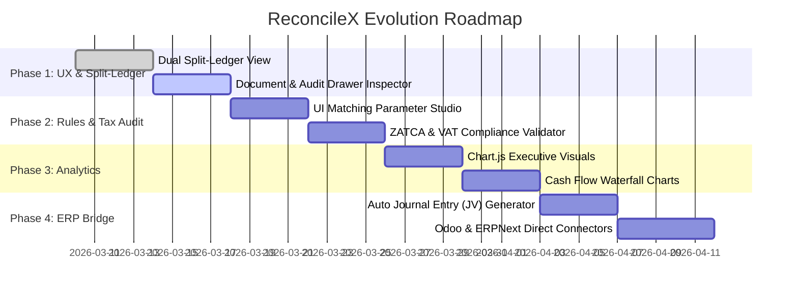

# ReconcileX Product & Engineering Roadmap 🚀
### Enterprise Transformation: From Core Engine to Flagship FinTech Studio

**Document Version:** 1.1.0  
**Author:** Ahmed Khaled (Ahmed Algendy) <contact@ahmedalgendy.com>  
**Status:** Active Execution  

---

## 🎯 Strategic Objective
Elevate **ReconcileX** from an already solid deterministic matching core into an **industry-grade enterprise financial studio** comparable to Tier-1 close automation tools (such as FloQast, BlackLine, and HighRadius), while maintaining its unique selling propositions: **100% Zero-Hallucination Math**, **Local-First Financial Privacy**, and native **Arabic/Multilingual OCR**.



---

## 📅 Milestone Breakdown

### 🔷 Phase 1: Enterprise Split-Ledger Workspace (UX Overhaul)
*Target: Visual excellence, interactive manual pairing, and forensic document inspection.*

1. **Dual-Pane Interactive Ledger Screen:**
   - **Left Ledger (Invoices / Accounts Payable):** Filter by status (Open, Cleared, Disputed), search by vendor name/tax ID, multi-select checkboxes.
   - **Right Ledger (Bank Feeds / Cash Outflows):** Filter by transaction direction, value range, reference search, multi-select checkboxes.
   - **Floating Interactive Match Bar:** When selecting $N$ invoices on the left and $M$ bank lines on the right:
     - Real-time sum calculations: $\sum \text{Invoices}$ vs $\sum \text{Bank}$.
     - Live delta calculation ($\Delta = \text{Difference}$).
     - One-click **"Manual Match Selected"** with custom reason prompt.
2. **Forensic Document & Audit Drawer (Inspector Modal):**
   - Click any invoice row to trigger a slide-out drawer.
   - Displays rendered invoice preview/thumbnail, parsed line items table, subtotal, tax rate, and extraction confidence score.
   - Displays cryptographic SHA-256 fingerprint for tamper-proof audit trails.

---

### 🔷 Phase 2: Dynamic Rules Studio & Regional Tax Compliance
*Target: Empowering accountants with real-time parameter tuning and regional tax checks.*

1. **In-Dashboard Parameter Studio (Sliding Controls):**
   - Date tolerance window slider ($\pm 1$ to $\pm 14$ days).
   - Vendor name fuzzy strictness threshold slider (50% to 100%).
   - Maximum bank fee variance threshold ($0.00 to $100.00).
   - Instant 1-click **"Re-run Engine"** applying new parameters without page refresh.
2. **ZATCA & Regional VAT Compliance Checker (Saudi Arabia & Egypt):**
   - Validation of standard 15% (GCC) and 14% (Egypt) VAT calculations.
   - Automatic flagging if a supplier invoice has mathematical tax errors before payment.
   - Extraction and decoding of ZATCA Phase 1 & 2 QR codes (TLV Base64 string validation).

---

### 🔷 Phase 3: Visual Financial Analytics & Executive Charts
*Target: Providing CFOs and controllers with high-level visual insight.*

1. **Reconciliation Distribution Donut Chart:**
   - Visual breakdown of cleared volume: Exact 1:1, Relaxed Fuzzy, Bundled 1:N, Fee Adjusted, and Pending.
2. **Daily Cash Flow & Settlement Waterfall:**
   - Timeline chart showing invoice issuance dates versus actual bank clearing dates to identify vendor payment cycle lag (DPO).
3. **Top Unmatched Counterparties Leaderboard:**
   - Identifies recurring unlinked charges (e.g., repeated unreceipted parking or SaaS expenses).

---

### 🔷 Phase 4: ERP Integration & Automated Journal Vouchers
*Target: Closing the loop between reconciliation and general ledger adjustment.*

1. **Automated Journal Entry (JV) Voucher Generator:**
   - Automatically writes balanced double-entry accounting entries for recognized variances (e.g., wire fees, FX loss/gain):
     ```text
     Account                       Debit ($)    Credit ($)
     -----------------------------------------------------
     5210 - Bank & Wire Fees          $20.00         -
     1010 - Cash at Bank               -           $20.00
     -----------------------------------------------------
     Total:                           $20.00       $20.00
     ```
   - One-click CSV/JSON export pre-formatted for QuickBooks, Xero, Odoo, and ERPNext.
2. **Headless ERP Webhook Ingestion:**
   - Automated nightly sync fetching draft purchase invoices from ERPNext or Odoo and auto-clearing paid items.

---

## 📈 Success Criteria & KPIs

- **Reconciliation Automation Rate:** $\ge 85\%$ of standard mid-market transactions cleared without manual touch.
- **Processing Speed:** Under 3.0 seconds for 500 invoices + 500 bank transactions.
- **Audit Verification:** 100% of matches include immutable rule identifier and evidence text.
